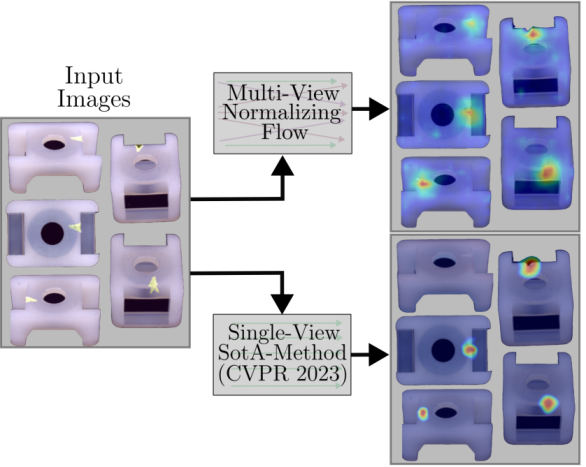

# Multi-Flow: Multi-View-Enriched Normalizing Flows for Industrial Anomaly Detection
[](https://arxiv.org/abs/2504.03306)

This is the official code to the paper [**"Multi-Flow: Multi-View-Enriched Normalizing Flows for Industrial Anomaly Detection"**](https://arxiv.org/pdf/2504.03306) 
by Mathis Kruse and Bodo Rosenhahn which was accepted to the CVPR 2025 Workshop VAND 3.0.




## Abstract
>With more well-performing anomaly detection methods proposed, many of the single-view tasks have been solved to a relatively good degree. However, real-world production scenarios often involve complex industrial products, whose properties may not be fully captured by one single image. While normalizing flow based approaches already work well in single-camera scenarios, they currently do not make use of the priors in multi-view data. We aim to bridge this gap by using these flow-based models as a strong foundation and propose Multi-Flow, a novel multi-view anomaly detection method. Multi-Flow makes use of a novel multi-view architecture, whose exact likelihood estimation is enhanced by fusing information across different views. For this, we propose a new cross-view message-passing scheme, letting information flow between neighboring views. We empirically validate it on the real-world multi-view data set Real-IAD and reach a new state-of-the-art, surpassing current baselines in both image-wise and sample-wise anomaly detection tasks.


## Installation Setup
To reproduce our results, please clone this repository. We recommend creating a new conda environment and installing all necessary modules. This code has been written and only tested on a Linux machine running openSUSE.
```shell
# (1) Cloning the repository
git clone git@github.com:m-kruse98/Multi-Flow.git
cd Multi-Flow

# (2) Create the environment with necessary CUDA & PyTorch frameworks
conda env create --file environment.yml 
conda activate multiflow
```

You will also need the necessary background segmentation models from the MVANet codebase, which may also found [here](https://github.com/qianyu-dlut/MVANet), and put them into the "models" directory. Alternatively just run the code below to directly download the necessary checkpoints.
```shell
# (3) Make sure steps (1)-(2) are completed. Download the model checkpoints from the MVANet repository
cd models
# Download MVANet Segmentation model checkpoint (~387 MB)
gdown https://drive.google.com/uc\?id\=1_gabQXOF03MfXnf3EWDK1d_8wKiOemOv
# Download Swin Transformer Checkpoint (~365 MB)
gdown https://drive.google.com/uc\?id\=1-Zi_DtCT8oC2UAZpB3_XoFOIxIweIAyk
cd ..
```

Additonally run the following script, to flip some of the camera views in Real-IAD, to force multi-view consistency across images. **ATTENTION**: This will change the images in the dataset **IN-PLACE** on your disk! This is not strictly required, but may improve performance.
```shell
# (4) (OPTIONAL) Make sure the paths are correctly set in flip_images.py
python flip_images.py
```


## Running the code

Make sure that all steps from the installation (optionally including *flip_images.py*) are done.

### Feature & Mask Extraction
Extract features and foreground masks for a desired class (e.g. *'audiojack'*) using
```shell
python preprocess.py -c audiojack
```

This needs to be run before any anomaly detection. **Important:** Make sure the paths in *'config.py'* point to your Real-IAD data set (including the *'realiad_jsons'* directory from *'realiad_jsons.zip'*). Features will be extracted to the new directory *'tmp/'*, with masks being saved to *'tmp/masks/'*.


**Note:** Consider parallelizing this extraction within a (Slurm-)Cluster as it may take quite some time for each class (~30-60 minutes or more possible).

### Running Anomaly Detection

Validate that the features and masks were correctly extracted to the respective directories, and that *'config.py'* links to them via the *'feature_dir'*. Then, to train and evaluate Multi-Flow, run

```shell
python train.py -c audiojack
```
Different options can be found using ```python train.py --help```. Hyperparameters may mostly be tweaked using the *'config.py'* file.


<section class="section" id="BibTeX">
  <div class="container is-max-desktop content">
    <h2 class="title">BibTeX  - Citation (non-preprint version pending)</h2>
    <pre><code>@misc{kruse2025multiflow,
    title={Multi-Flow: Multi-View-Enriched Normalizing Flows for Industrial Anomaly Detection},
    author={Mathis Kruse and Bodo Rosenhahn},
    year={2025},
    eprint={2504.03306},
    archivePrefix={arXiv},
    primaryClass={cs.CV}
    }
}</code></pre>
  </div>
</section>
    

## Credits

Credits go to the following code bases. Check out their amazing work:
- [ADEval](https://github.com/winggan/adeval) (optimized AUROC/AUPRO routines)
- [CS-Flow](https://github.com/marco-rudolph/cs-flow) (anomaly detection and normalizing flow code)
- [MVANet](https://github.com/qianyu-dlut/MVANet) (pre-trained segmentation networks)
- [Real-IAD](https://github.com/Tencent/AnomalyDetection_Real-IAD) (data loading routines)


### Acknowledgements

This work was supported by the Federal Ministry of Education and Research (BMBF), Germany, under the AI service center KISSKI (grant no. 01IS22093C), the MWK of Lower Sachsony within Hybrint (VWZN4219), the Deutsche Forschungsgemeinschaft (DFG) under Germany’s Excellence Strategy within the Cluster of Excellence PhoenixD (EXC2122), the European Union  under grant agreement no. 101136006 – XTREME.

### License

This project is licensed under the MIT license. However, do take note of the licenses of the credited repositories ADEval, CS-Flow, MVANet and Real-IAD.
